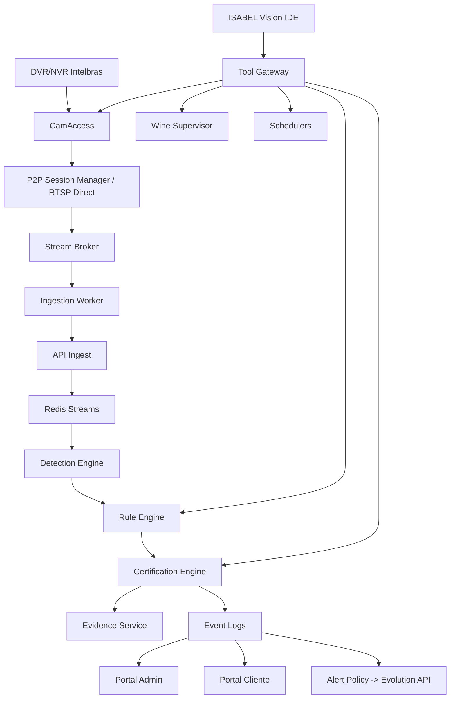

# 01 - Arquitetura do Servidor Único

## Escopo

Uma única VM Ubuntu no Proxmox hospeda serviços isolados. A consolidação física não transforma o sistema em monólito.

## Fluxo principal

## Domínios

### Core
- API central.
- Autenticação e autorização.
- Isolamento multi-tenant.
- Auditoria imutável de operações sensíveis.

### Dispositivos
- Condomínios.
- Usuários.
- DVR/NVR.
- Câmeras.
- Estado online/degradado/offline.

### P2P
- Sessões Intelbras P2P.
- Registro dinâmico de portas locais.
- Histórico de troca de túnel.
- Wine Supervisor.
- Failover e troca emergencial por DVR.

### Ingestão
- Leitura do stream normalizado.
- Resize operacional.
- Controle de FPS.
- MOG2/scene change.
- ROI de pré-filtro.
- Heartbeat.

### Detecção
- Detector geral YOLO.
- Tracking por câmera.
- Pose seletivo.
- Detector de placas.
- OCR de placas.
- Classificador child/adult/unknown.
- Mudança estrutural/scene change.

### Regras
- ROI e polígonos.
- Linhas perimetrais.
- Linhas duplas.
- Linhas de disparo.
- Direção/trajetória.
- Máquinas de estado temporais.
- Versionamento e rollback.
- Shadow mode e simulador.

### Certificação
Nenhuma regra nova entra diretamente em produção. Cada combinação `condomínio + DVR + câmera + evento + versão` possui ciclo próprio de homologação.

### Evidências
- Prebuffer de vídeo.
- Snapshot.
- Mini-clipe antes/depois.
- Metadados no PostgreSQL.
- Objeto no MinIO.

### IA operacional
A ISABEL Vision IDE interpreta chat e usa apenas ferramentas autorizadas. Mudanças críticas exigem preview/aprovação.

## Prioridade de GPU

1. Detecção em produção.
2. Regras/modelos auxiliares.
3. OCR de placa.
4. AI Event Reviewer.
5. ISABEL Vision IDE.

O chat nunca pode degradar a taxa operacional das câmeras.

## Estados de câmera

- `ONLINE`
- `DEGRADED`
- `OFFLINE`
- `P2P_CONNECTED_NO_VIDEO`
- `VIDEO_NO_FRAMES`
- `DECODER_ERROR`
- `AUTH_ERROR`

Online exige frame recente e heartbeat; não basta sessão P2P aberta.
